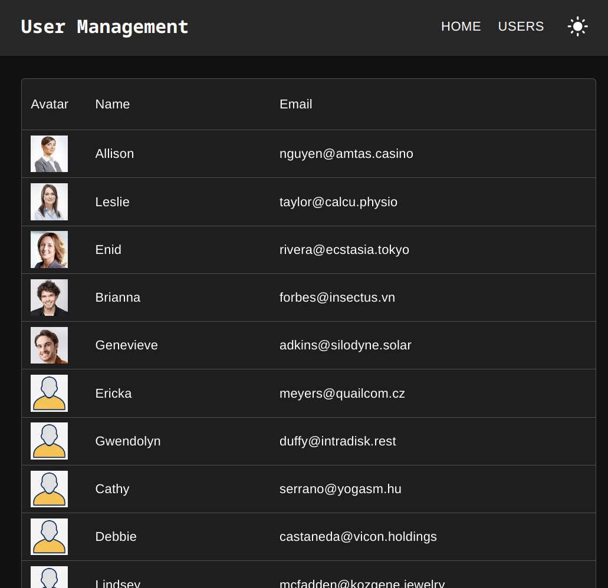

# User Management

A simple user management as a sample of next project


## How to use

0. You can change `baseUrl` from [next.config.js](next.config.js)
1. Run `npm install` to install all dependencies.
2. How to start the project:
  * Run `npm run dev` to start the server in the development mode.
  * Run `npm run build` to generate build files, and `npm run start` to start server in production mode. (Use production mode to check dynamic import.)

3. Open [http://localhost:3000](http://localhost:3000) with your browser to see the result.
4. In the **development mode** , the page will reload if you make edits.


## Sample data

Users' sample data is available in [src/sample-data/users.json](src/sample-data/users.json).

```javascript
[
  {
    "id": 1,
    "email": "sadra@example.com",
    "firstName": "Sadra",
    "lastName": "Shirazi",
    "age": 36,
    "address": "63 Hanson Place, Alfarata, Illinois",
    "avatarUrl": "/avatars/fdsar.jpg"
  },
  ...
]
```
There are sample avatars in [public/avatars](public/avatars).


## Generate fake date by json-generator.com
The sample users data generated by [json-generator.com](https://app.json-generator.com/zIzPBDLwWP-Y).

The following is the config for the json generator:
```
 JG.repeat(1, 100, {
     id: JG.index(),
     email() {
         return (
             _.snakeCase(this.name) +
             '@' +
             JG.company() +
             JG.domainZone()
         ).toLowerCase();
     },
     firstName: JG.firstName(),
     lastName: JG.lastName(),
     age: JG.integer(18, 70),
     address: `${JG.integer(1, 100)} ${JG.street()}, ${JG.city()}, ${JG.state()}`,
 });
```


## Features and Examples

- MUI and Theme config [src/theme/theme.ts](src/app/users/[id]/page.tsx)
- TypeScript [src/types/index.ts](src/app/users/[id]/page.tsx)
- Preload Images [src/app/preload-images.tsx](src/app/users/[id]/page.tsx)
- Context [src/context](src/context)
- Routes and Dynamic routes [src/app/users/[id]/page.tsx](src/app/users/[id]/page.tsx)
- Lighthouse report [lighthouse](lighthouse)
- UI Responsibility


## Screenshots

The app's screenshots can be found [public/avatars](public/avatars).




## TODO

- [x] Add routes/pages (Home, User List Page and User Details Page)
- [x] User List Page
  - [x] Display a list of users (Name, Email, Age, and Actions)
  - [x] Pagination
    - [x] Limit to 10 users per page
  - [x] Sort (sorting for Name and Age)
  - [x] Search
- [x] User Details Page
  - [x] Display detailed information of a selected user (Full Name, Email, Age, Address, and Profile Picture)
  - [x] Provide a back button (_Added Breadcrumbs instead of a back button_)
- [x] Home page (fetch data from [JSONPlaceholder](https://jsonplaceholder.typicode.com/))
  - [x] List posts
  - [x] Add new post
  - [x] Delete post
- [x] TypeScript
- [x] React Feature (useState, useEffect, useMemo)
- [x] State Management (theme switcher)
- [ ] Performance
  - [x] next/dynamic (next/dynamic is a composite of React.lazy() and Suspense)
  - [x] Lighthouse
  - [ ] Optimize code
- [ ] Documentation
  - [x] README.md
  - [x] Screenshots
  - [ ] Storybook
- [x] Responsiveness
- [ ] Tests
  - [ ] Unit Test
  - [ ] E2E Test
  - [ ] Interactions by storybook
  - [ ] Accessibility
- [ ] CI/CD
- [ ] Config ESLint


## Feedback

Please submit an issue on GitHub if you have any feedback


## Contributing

Contributions are always welcome!

To contribute to this repository, please make a PR.


## Authors

- Mostafa Mirmousavi [@mirmousaviii](https://github.com/mirmousaviii) [https://mirmousavi.com](https://mirmousavi.com)


## License

[MIT](https://choosealicense.com/licenses/mit/)


## References

* https://reactjs.org
* https://nextjs.org
* https://mui.com
* https://app.json-generator.com
* https://jsonplaceholder.typicode.com
* https://readme.so